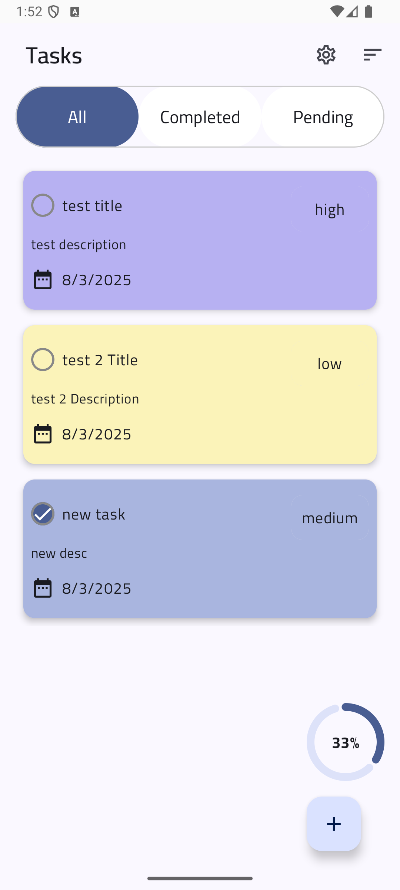
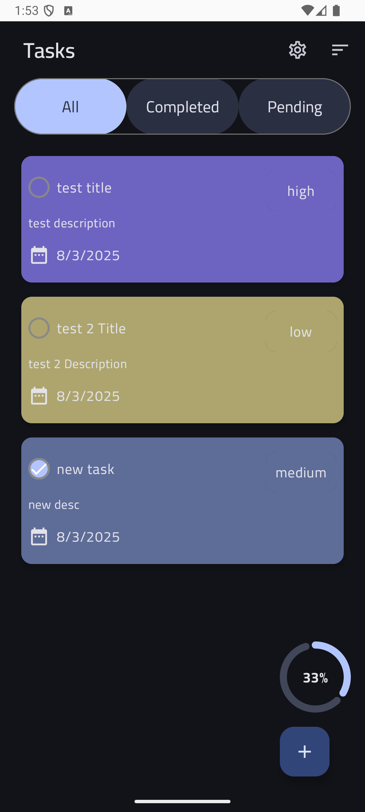
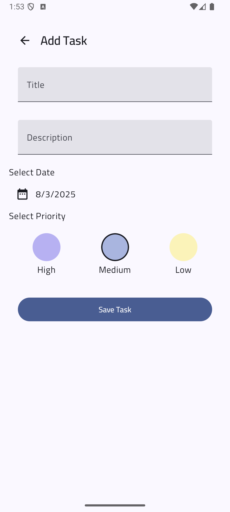
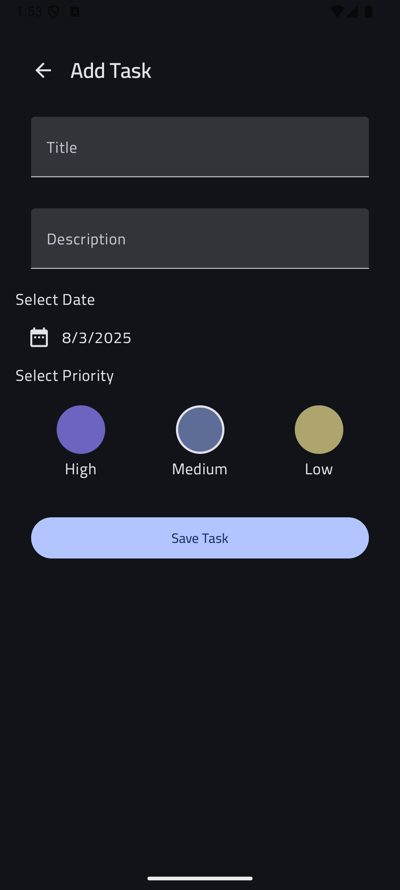
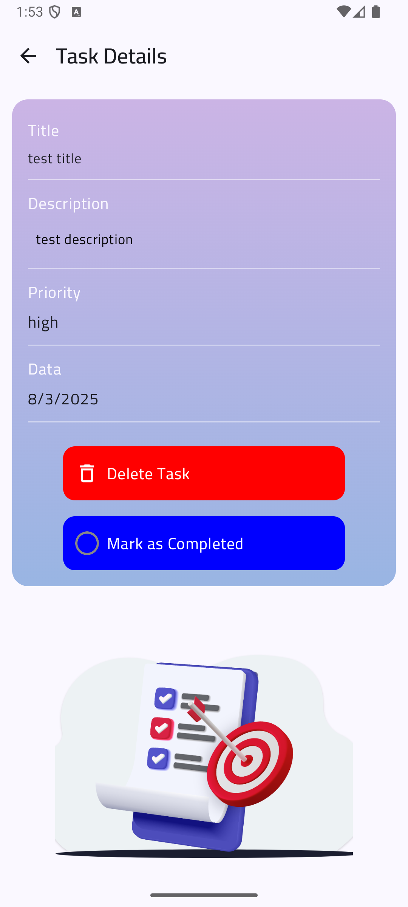
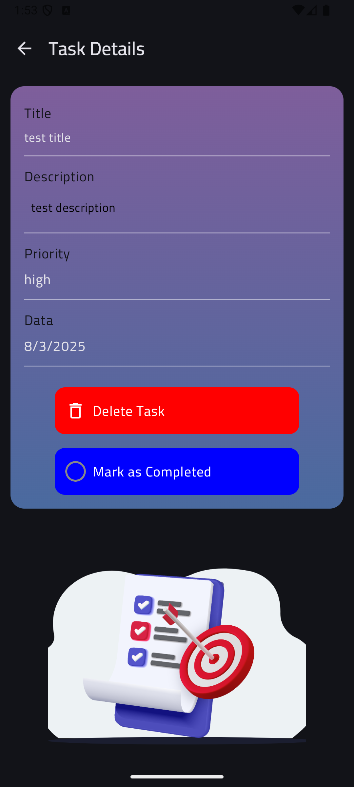
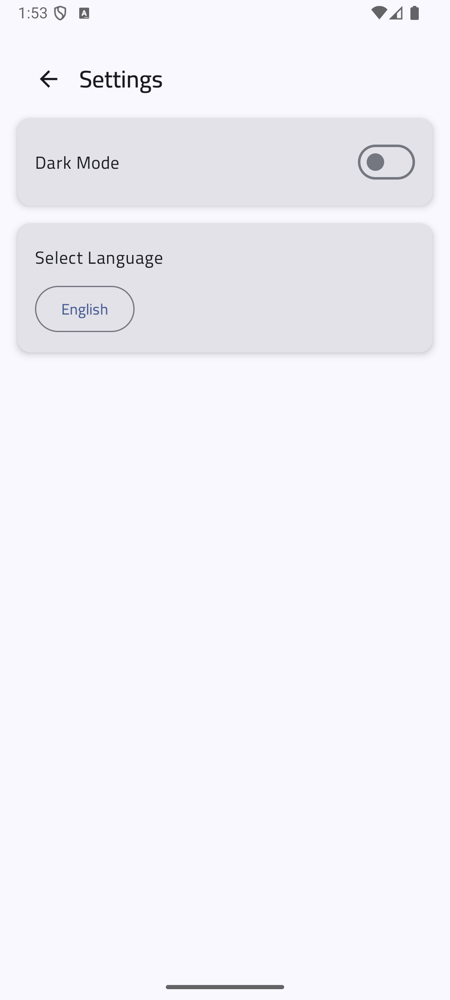
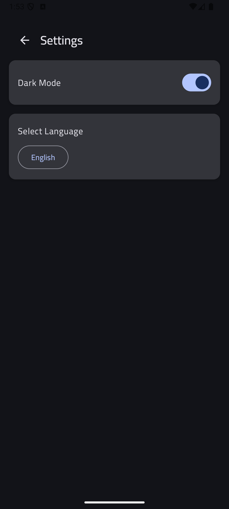

Task Manager

📌 Overview

Task Manager is an Android application built with Kotlin and Jetpack Compose. It helps users manage their tasks efficiently with features such as task categorization, progress tracking, sorting, and theme customization.

📱 Screens

1. Task List Screen

The main screen that displays the user's tasks. It includes:

Tabs to filter tasks: All, Completed, and Pending

Floating Action Button (FAB) to navigate to the Add Task Screen

A progress indicator to show task completion status

Sorting functionality

A Settings button to access the Settings Screen

A swipe-to-delete feature for removing tasks

2. Add Task Screen

This screen allows users to add a new task by filling in the following fields:

Title

Description

Task Date

Priority

3. Task Details Screen

Displays details of a specific task and provides two actions:

Mark as Completed

Delete Task

4. Settings Screen

Users can customize the app by:

Changing the language

Switching between light and dark themes

🛠️ Tech Stack & Dependencies

This project follows MVI architecture with Clean Architecture principles. The dependencies used include:

dependencies {
    implementation(libs.androidx.core.ktx)
    implementation(libs.androidx.lifecycle.runtime.ktx)
    implementation(libs.androidx.activity.compose)
    implementation(platform(libs.androidx.compose.bom))
    implementation(libs.androidx.ui)
    implementation(libs.androidx.ui.graphics)
    implementation(libs.androidx.ui.tooling.preview)
    implementation(libs.androidx.material3)
    testImplementation(libs.junit)
    androidTestImplementation(libs.androidx.junit)
    androidTestImplementation(libs.androidx.espresso.core)
    androidTestImplementation(platform(libs.androidx.compose.bom))
    androidTestImplementation(libs.androidx.ui.test.junit4)
    debugImplementation(libs.androidx.ui.tooling)
    debugImplementation(libs.androidx.ui.test.manifest)

    // Room Database
    implementation(libs.androidx.room.ktx)
    implementation(libs.androidx.room.runtime)
    ksp(libs.androidx.room.compiler)

    // ViewModel & Compose
    implementation(libs.androidx.lifecycle.viewmodel.compose)

    // Dependency Injection (Koin)
    implementation(libs.koin.android)
    implementation(libs.koin.androidx.compose)

    // Animations
    implementation(libs.google.accompanist.navigation.animation)

    // Lottie Animations
    implementation(libs.lottie.compose)

    // Shared Preferences (DataStore)
    implementation(libs.datastore.preferences)
}

🎯 Architecture

The application follows MVI (Model-View-Intent) architecture with Clean Architecture principles to ensure separation of concerns, scalability, and maintainability.

📸 Screenshots

## 📸 Screenshots

### Task List Screen

### Add Task Screen

### Task Details Screen

### Settings Screen

🚀 Getting Started

To run the project, follow these steps:

Clone the repository

Open it in Android Studio

Sync dependencies and build the project

Run the application on an emulator or a physical device

📜 License

This project is licensed under the MIT License.
